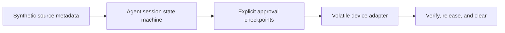

# Hardware Secret Agent

A small, runnable Swift reference preview: discover synthetic records, approve a session, step through simulated device checkpoints, then store, verify, and clear. Try skipping a checkpoint and see the action rejected.

The useful idea is simple: discovery is not permission to transfer, and a PIN acknowledgement alone is not permission to store.

This repository is intentionally standalone. It uses no real accounts, credentials, exports, device APIs, product infrastructure, or network services.

## What you can try

- Metadata-only discovery across four synthetic source categories
- An explicit approval checkpoint before any simulated transfer
- Ordered connect, PIN, and physical-presence checkpoints
- Volatile in-process storage behind an actor boundary
- Store-and-verify behavior before release
- Clearing the device adapter and local candidate buffers at session end
- Fail-closed rejection of out-of-order actions



## State sequence

```text
idle
  -> scanned
  -> approved
  -> deviceConnected
  -> pinAcknowledged
  -> presenceConfirmed
  -> storedAndVerified
  -> releasedAndCleared
```

Each operation validates the current phase before changing state. An invalid transition throws an error and leaves the session unchanged.

## Run it

Requirements: macOS 13 or newer and Swift 6.

```bash
swift run hardware-secret-agent

# See what happens when approval or presence is skipped
swift run hardware-secret-agent --scenario blocked

# Run the walkthrough and all three blocked-action examples
swift run hardware-secret-agent --scenario all
swift test
```

No setup, account, environment variables, or device is needed. See the [two-minute walkthrough](docs/WALKTHROUGH.md) for what to look for.

The command prints synthetic source categories, counts, checkpoints, and transition errors. The source schema has no dedicated secret-value field; its string fields are not a sanitizer, so use synthetic inputs only.

## Try the boundaries

| Example | What you can observe |
| --- | --- |
| Normal walkthrough | Four synthetic categories, ten generated records, and zero adapter records after completion |
| Connect before approval | Rejected while the session stays `scanned` |
| Store after PIN without presence | Rejected while the session stays `pinAcknowledged` |
| Reuse a completed session | Rejected while the session stays `releasedAndCleared` |

The blocked scenario checks the exact error and compares snapshots before and after each attempt. An unexpected result exits with a nonzero status. The default command still runs the normal walkthrough; `--help` lists the options.

## Repository layout

```text
Sources/HardwareSecretAgentCore/
  AgentSession.swift          ordered workflow coordinator
  Models.swift                metadata and snapshot schemas
  SyntheticCatalog.swift      deterministic source metadata
  VolatileDeviceAdapter.swift in-memory hardware stand-in
Sources/hardware-secret-agent/
  main.swift                  walkthrough and blocked-action scenarios
Tests/
  HardwareSecretAgentCoreTests/
```

## Security boundary

This is an early reference implementation, not a production secret manager or hardware integration. The adapter is process memory, the PIN and physical-presence steps are acknowledgements, and the payloads are generated synthetic bytes. Swift does not guarantee complete erasure of copied `Data` storage; the explicit buffer reset illustrates intent rather than a formal zeroization guarantee.

A production implementation would need an audited hardware protocol, authenticated transport, platform-specific secure memory handling, strict connector permissions, threat modeling, recovery design, and independent security review.

## Scope of this preview

This public sample focuses on the workflow and its observable boundaries. It does not include real credential connectors, a native product UI, hardware firmware or transport, cryptography, recovery, or application delivery. It is not a preview build of a finished product.

`releaseAndClear` closes the simulated session and clears its buffers; it does not release a credential into another process. Source counts are fixed fixtures, not the result of scanning your Mac.

## Design principles

1. Keep discovery metadata separate from secret material.
2. Require an explicit checkpoint for every authority increase.
3. Make the legal transition path small and testable.
4. Verify storage before reporting success.
5. Clear volatile state at the end of every completed session.
6. Treat unexpected ordering as an error, never as an implicit shortcut.

No license is granted by default. Add the license that matches your intended use before redistributing the code.
